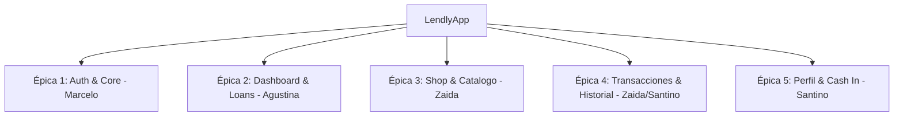

# Espec Funcional — LendlyApp
**Versión 1.0 — Mayo 2026**

---

## 1. Objetivo

El sistema **LendlyApp** es una aplicación móvil nativa para Android diseñada para automatizar y facilitar el acceso a microcréditos, la adquisición de productos a crédito (Shop integrado) y el control financiero personal de los usuarios. 

La aplicación reemplaza la necesidad de realizar simulaciones financieras manuales y de acudir a plataformas web complejas, ofreciendo una experiencia 100% móvil, intuitiva, rápida y con validación automática de perfiles crediticios a través de una API REST.

---

## 2. Contexto del Problema Actual

En la actualidad, los estudiantes y jóvenes profesionales de Software ORT carecen de una herramienta financiera unificada que les permita:
* Evaluar su puntaje crediticio de forma instantánea.
* Simular y contratar préstamos personales adaptados a su perfil de riesgo.
* Acceder a un catálogo de productos electrónicos y de estudio, y adquirirlos en cuotas financiadas.
* Realizar un seguimiento transparente de todos sus movimientos (ingresos de saldo, compras y cuotas pagadas).

LendlyApp resuelve esto integrando todos estos flujos bajo una arquitectura de software limpia (Clean Architecture) y moderna utilizando Jetpack Compose en Android.

---

## 3. Alcance

### 3.1 Dentro del Alcance

| Módulo / Épica | Descripción |
|---|---|
| **Registro y Autenticación** | Pantalla de Splash, Login con validaciones, Registro de nuevos usuarios y persistencia de sesión con DataStore. |
| **Navegación Core** | Bottom Navigation Bar para cambiar entre las 5 pestañas principales: Home, Préstamos, Tienda, Historial y Perfil. |
| **Dashboard (Home)** | Indicador visual animado de Credit Score (Gauge), perfil básico del usuario y resumen de balance actual. |
| **Simulador y Solicitud de Préstamos** | Calculador interactivo de cuotas, montos e intereses, y solicitud de créditos con aprobación inmediata basada en el Score. |
| **Tienda (Shop)** | Catálogo de productos, ficha detallada del producto y simulación de compra financiada a crédito. |
| **Historial Financiero** | Lista cronológica de transacciones (Cash In, Cuota Pagada, Compra) con filtros rápidos. |
| **Perfil y Administración** | Actualización de perfil del usuario, Cash In (recarga de saldo simulada) y cierre seguro de sesión. |

### 3.2 Fuera del Alcance

| Área / Módulo | Motivo |
|---|---|
| **Pasarelas de Pago Reales (Stripe/MercadoPago)** | Fuera de scope; los pagos y recargas de saldo se simulan a través de endpoints de la API REST de prueba. |
| **Envío de SMS/WhatsApp reales para verificación** | La verificación se simula en la UI de Registro para simplificar el flujo del examen. |
| **Emisión física de tarjetas de débito/crédito** | LendlyApp funciona exclusivamente como billetera y simulador de crédito digital. |

---

## 4. Backlog de Épicas y Tareas (División por Integrantes)

Para garantizar un desarrollo ordenado y sin solapamientos en Git, el proyecto se divide en **5 Épicas**, asignadas equitativamente entre los 4 integrantes del equipo.

---

### 📋 Épica 1: Setup Core & Módulo de Autenticación
* **Responsable:** Marcelo Wainschenker
* **Estado:** Completado (Rama `feature/auth`)

| Código | Tarea / Subtarea | Estimación |
|---|---|---|
| **T1.1** | Configuración base del proyecto, Gradle Kotlin DSL, Hilt y dependencias en `libs.versions.toml`. | 3h |
| **T1.2** | Configuración del módulo de red base con Retrofit, Gson y el interceptor de seguridad `x-api-key: 123456789`. | 2h |
| **T1.3** | Implementación de persistencia segura de sesión (`auth_token`) con **AndroidX DataStore**. | 3h |
| **T1.4** | Pantalla de **Splash**: Lógica de desvío automático (si hay token → Home; si no → Login). | 2h |
| **T1.5** | Pantalla de **Login**: UI responsiva, validaciones de email y password, consumo de `/auth/login`. | 5h |
| **T1.6** | Pantalla de **Registro**: Formulario completo (Nombre, Apellido, DNI, Email, Password) y consumo de `/auth/create`. | 6h |
| **T1.7** | Estructuración de la navegación base (`AppNavigation`) y configuración del Bottom Navigation Bar. | 4h |

---

### 📋 Épica 2: Dashboard & Módulo de Préstamos (Loans)
* **Responsable:** Agustina Salatino
* **Estado:** Pendiente

| Código | Tarea / Subtarea | Estimación |
|---|---|---|
| **T2.1** | Diseño de la pantalla de **Dashboard (Home)**: Datos básicos del usuario (balance, límite de crédito) y accesos rápidos. | 5h |
| **T2.2** | Desarrollo del componente personalizado **Credit Score Gauge**: Gráfico animado que represente el nivel crediticio (rojo/amarillo/verde). | 5h |
| **T2.3** | Pantalla de **Listado de Préstamos**: GET `/loans` para listar préstamos activos y cancelados con su estado de cuotas. | 4h |
| **T2.4** | **Simulador de Préstamos**: Selector deslizante de monto (hasta el límite permitido) y plazo (3, 6, 12 cuotas), con cálculo en tiempo real de intereses. | 6h |
| **T2.5** | Solicitud y Aprobación: POST `/loans/apply` para crear el préstamo y redirigir a una pantalla de éxito/error. | 5h |

---

### 📋 Épica 3: Catálogo de Tienda (Shop)
* **Responsable:** Zaida Martinez
* **Estado:** Pendiente

| Código | Tarea / Subtarea | Estimación |
|---|---|---|
| **T3.1** | Diseño de la pantalla **Shop (Catálogo)**: Grilla interactiva con tarjetas de productos. | 5h |
| **T3.2** | Integración del consumo de GET `/products` y renderización con carga de imágenes asíncronas usando **Coil**. | 4h |
| **T3.3** | Pantalla de **Detalle del Producto**: Ficha técnica, precio de contado, y selector para calcular cuotas financiadas. | 5h |
| **T3.4** | Lógica de **Compra a Crédito**: Consumo del endpoint de compra (POST `/purchases/create`), validando si el usuario tiene límite de crédito suficiente. | 6h |

---

### 📋 Épica 4: Transacciones & Historial Financiero
* **Responsables:** Zaida Martinez & Santino Lamberti
* **Estado:** Pendiente

| Código | Tarea / Subtarea | Estimación |
|---|---|---|
| **T4.1** | Pantalla de **Historial (History)**: Diseño de lista cronológica unificada de movimientos (GET `/transactions`). | 4h |
| **T4.2** | Chips de filtrado rápido por tipo: *Todos, Préstamos, Compras, Ingresos (Cash In)*. | 3h |
| **T4.3** | Detalle de Transacción: Modal o BottomSheet que muestre la información ampliada (fecha, ID de transacción, descripción, método de pago). | 4h |

---

### 📋 Épica 5: Perfil del Usuario & Operaciones (Manage)
* **Responsable:** Santino Lamberti
* **Estado:** Pendiente

| Código | Tarea / Subtarea | Estimación |
|---|---|---|
| **T5.1** | Pantalla **Manage (Perfil)**: Muestra información personal completa del usuario (GET `/users/{id}`). | 4h |
| **T5.2** | Formulario de **Actualización de Perfil**: Permitir modificar datos de contacto (teléfono, email) mediante PUT `/users/{id}`. | 5h |
| **T5.3** | Pantalla de **Cash In (Carga de Saldo)**: Formulario para ingresar montos ficticios, simulando un depósito exitoso en la cuenta (POST `/users/cash-in`). | 5h |
| **T5.4** | Flujo de **Cierre de Sesión**: Limpieza del `auth_token` en el DataStore y redirección inmediata al Login, limpiando el backstack de navegación. | 3h |

---

## 5. Especificación de Pantallas y Flujos de Usuario

### 5.1 Flujo de Autenticación
1. **Splash Screen:** Muestra la marca Lendly. Verifica en background si existe un token persistido en `DataStore`.
   * Si existe token: Navega a `Home` (Dashboard).
   * Si no existe token: Navega a `Login`.
2. **Login Screen:** Pide Email y Contraseña. 
   * Tiene validaciones locales de formato.
   * Al presionar "Ingresar", muestra un indicador de carga (`CircularProgressIndicator`) y consume `/auth/login`.
   * Ante éxito: guarda el token y navega a `Home`.
   * Ante error: muestra un mensaje interactivo en pantalla (Snackbar).
3. **Register Screen:** Permite crear una cuenta.
   * Campos: Nombre, Apellido, DNI, Email, Password, Confirmar Password.
   * Validaciones estrictas: DNI numérico, Email válido, coincidencia de contraseñas.
   * Al registrarse, se consume `/auth/create` y navega automáticamente al login con el email precargado.

### 5.2 Dashboard (Home)
* **Credit Score Gauge:** Componente dinámico en forma de arco (Gauge) que posiciona una aguja según el score del usuario (rango 0 - 1000).
  * **0 - 399 (Rojo):** Score bajo. Límite de crédito limitado.
  * **400 - 699 (Amarillo):** Score regular/bueno. Límite intermedio.
  * **700 - 1000 (Verde):** Score excelente. Límite de crédito máximo.
* **Tarjeta de Balance:** Muestra el saldo disponible para compras (ficticio) y el límite disponible de crédito.
* **Sección de Atajos rápidos:** Botones flotantes para navegar directamente a: *Solicitar Préstamo*, *Comprar en Tienda* o *Cargar Saldo*.

### 5.3 Módulo de Préstamos
* **Calculadora:** Deslizador (`Slider`) para elegir el monto deseado. El monto máximo se autocalcula según el Credit Score obtenido del perfil de usuario.
* **Selector de Cuotas:** 3 botones para elegir entre 3, 6 y 12 cuotas.
* Al seleccionar, se muestra el desglose del plan:
  * Monto solicitado.
  * Tasa de Interés Aplicada (fija mensual).
  * Valor de cada cuota.
  * Total a devolver.
* **Botón "Confirmar Préstamo":** Dispara el POST a la API. Muestra pantalla de éxito animada y actualiza el saldo disponible en el Home.

---

## 6. Reglas de Negocio Consolidadas

1. **Límites de Crédito según Score:**
   * `Score < 400`: Límite máximo de préstamo de `$15,000`. Tasa de interés del `12%` mensual.
   * `400 <= Score < 700`: Límite máximo de préstamo de `$50,000`. Tasa de interés del `8%` mensual.
   * `Score >= 700`: Límite máximo de préstamo de `$150,000`. Tasa de interés del `5%` mensual.
2. **Exclusión de Compra en Shop:** No se puede adquirir ningún producto si su valor financiado en 1 cuota excede el límite de crédito disponible actual del usuario.
3. **Autenticación Obligatoria:** Todas las peticiones HTTP (salvo `/auth/login` y `/auth/create`) deben adjuntar el Bearer Token en el header `Authorization`, además de la API key global en `x-api-key`.

---

## 7. Requerimientos No Funcionales

* **Determinismo de la UI:** La interfaz debe reaccionar de forma fluida a los estados de carga, error y éxito (`UiState` usando sellados en Kotlin).
* **Persistencia Reactiva:** El estado del token se observa mediante Kotlin Flows desde el DataStore, asegurando que la UI cambie de inmediato al expirar o cerrar sesión.
* **Responsividad:** Soporte para pantallas medianas, pequeñas y modo oscuro básico adaptando las paletas de colores del Theme de Material 3.
